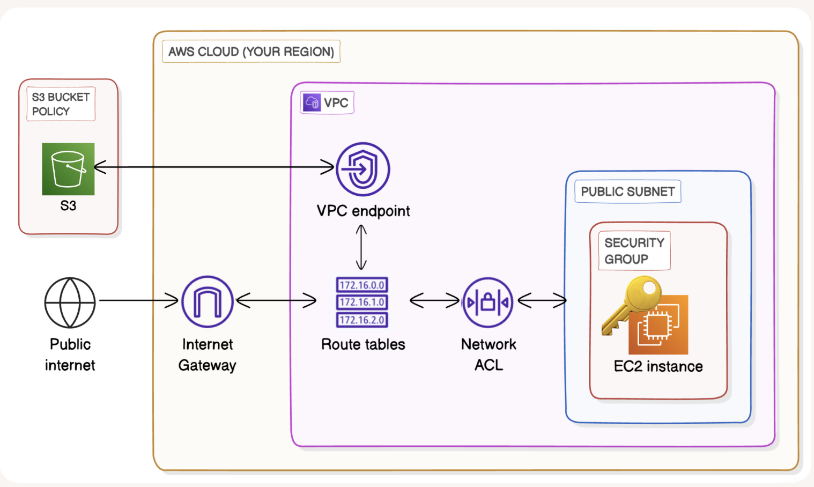

# VPC Endpoints

**Project Link:** [View Project](http://learn.nextwork.org/projects/aws-networks-endpoints)

**Author:** Adeem Akhtar  
**Email:** adeemakhtar@gmail.com

---

## VPC Endpoints

---

## Introducing Today's Project!

### What is Amazon VPC?

Amazon VPC is an isolated private network inside the AWS cloud environment, and it is useful because we can launch and arrange other AWS services inside the VPC.

### How I used Amazon VPC in this project

In today's project, I used Amazon VPC to launch the following:
VPC
public subnet
EC2 instance
Endpoint

### One thing I didn't expect in this project was...

One thing I didn't expect in this project was "Endpoint policy"

### This project took me...

This project took me 45 minutes

---

## In the first part of my project...

### Step 1 - Architecture set up

In this step, I will do the following:
1. Create a VPC from scratch!
2. Launch an EC2 instance, which you'll connect to using EC2 Instance Connect later.
3. Set up an S3 bucket.

### Step 2 - Connect to EC2 instance

In this step, I will connect directly to the eEC2 instance using AWS CLI because that terminal will be used to access the S3 bucket.

### Step 3 - Set up access keys

In this step, I will generate the access keys because these keys will be used as the credentials to get access to the AWS service.

### Step 4 - Interact with S3 bucket

In this step, I will get your EC2 instance CLI to access your S3 bucket.

---

## Architecture set up

I started my project by launching a VPC with an availability zone and 1 public subnet.
Secondly, I launched an EC2 instance in the public subnet.

I have set up the S3 bucket with the name "nextwork-vpc-project-adeem"

---

## Access keys

### Credentials

To set up my EC2 instance to interact with my AWS environment, I configured the following:
1. Access Key ID
2. Secret Access Key
3. Region
4. Output Forman

Access keys are the credentials that are used to authenticate the service to get access to other AWS services.

The secret access key is like the password that pairs with your access key ID (your username). You need both to access AWS services.

Anyone who has it can access your AWS account, so we need to keep this away from anyone else!

### Best practice

Although I'm using access keys in this project, a best practice alternative is to use an IAM role. 

---

## Connecting to my S3 bucket

The command I ran was "aws s3 ls" This command is used to list all the available S3 buckets in the AWS environment.

The terminal responded with the list of available S3 buckets in the AWS environment. This indicated that the access keys I set up correctly authenticated the CLI to access the S3.

---

## Connecting to my S3 bucket

I also tested the command "aws s3 ls s3://nextwork-vpc-project-" which returned the file uploaded in the S3.

---

## Uploading objects to S3

To upload a new file to my bucket, I first ran the command "sudo touch /tmp/nextwork.txt" This command creates a text file "nextwork.txt" in "/tmp" directry.

The second command I ran was "aws s3 cp /tmp/nextwork.txt s3://nextwork-vpc-project-adeem"  This command will upload the text file from the "/tmp" directory to "s3://nextwork-vpc-project-adeem"

The third command I ran was "aws s3 ls s3://nextwork-vpc-project-adeem", which validated that the created text file was successfully uploaded to the S3 bucket.

---

## In the second part of my project...

### Step 5 - Set up a Gateway

In this step, I will set up a way for your VPC and S3 to communicate directly.

### Step 6 - Bucket policies

I need to test my endpoint if it is working properly as planned or not. So I will limit S3 bucket access to only traffic from the endpoint.

### Step 7 - Update route tables

In this step, I will test the VPC endpoint set up and troubleshoot a connectivity issue.

### Step 8 - Validate endpoint conection

In this step, I will do the following:
1. Test your VPC endpoint set up (again).
2. Restrict the VPC's access to the AWS environment.

---

## Setting up a Gateway

I set up an S3 Gateway, which is a type of endpoint used specifically for Amazon S3 and DynamoDB (DynamoDB is an AWS database service).

Gateways work by simply adding a route to your VPC route table that directs traffic bound for S3 or DynamoDB to head straight for the Gateway instead of the internet.

### What are endpoints?

An endpoint in AWS is a service that allows private connections between your VPC and other AWS services without needing the traffic to go over the internet.

---

## Bucket policies

A bucket policy is a type of IAM policy designed for setting access permissions to an S3 bucket. Using bucket policies, you get to decide who can access the bucket and what actions they can perform with it.

My bucket policy will allow traffic only through the endpoint.

---

## Bucket policies

The policy denies all actions unless they come from your VPC endpoint. This means any attempt to access your bucket from other sources, including the AWS Management Console, is blocked!

I also had to update my route table because the added route from endpoint to S3 will provide the access to the S3 from the public subnet using EC2 CLI.

---

## Route table updates

To update my route table, I managed the route table from the endpoint by selecting the public subnet and its route table. This updated the public subnet's route table automatically.

After updating my public subnet's route table, my terminal could return files in my S3 bucket.

---

## Endpoint policies

An endpoint policy is the policy that is used to deny or allow the access to the service that could be accessed through the endpoint.

I updated my endpoint's policy by denying the effect. I could see the effect of this right away, because my EC2 CLI was not able to access the S3.

---

---
