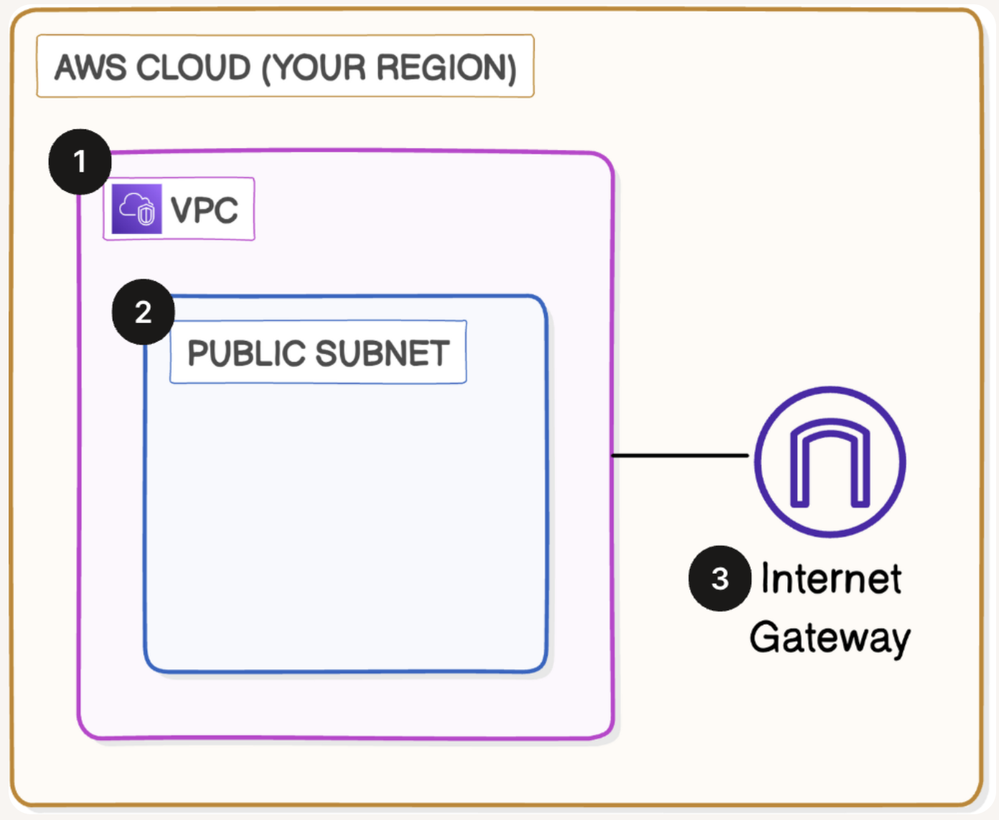

# Build a Virtual Private Cloud

**Project Link:** [View Project](http://learn.nextwork.org/projects/aws-networks-vpc)

**Author:** Adeem Akhtar  
**Email:** adeemakhtar@gmail.com

--- 

## Build a Virtual Private Cloud (VPC)

---

## Introducing Today's Project!

In this project, I will demonstrate VPC networking.  I'm doing this project to learn about AWS VPC, subnets and the internet gateway.

### What is Amazon VPC?

Amazon VPC is an isolated network in the cloud, and it is useful because it gives you full control over your cloud network.

In today's project, I used Amazon VPC to manage a public subnet to get it connected with an internet gateway for internet connectivity.

### Personal reflection

This project took me 20 minutes.

One thing I didn't expect in this project was using CLI commands on Cloud Shell.

---

## Virtual Private Clouds (VPCs)

### What I did in this step

In this step, I will open the AWS console manager and create a VPC.

### How VPCs work

VPCs are isolated networks inside the cloud, where we can launch and control resources like servers, databases, and applications securely. 

### Why there is a default VPC in AWS accounts

There has been a default VPC in my account since my AWS account was created. This is because a pre-configured virtual network is created automatically in each region.

### Defining IPv4 CIDR blocks

To set up my VPC, I had to define an IPv4 CIDR block, which is a way to assign a contiguous block of IP addresses, like a segment.

---

## Subnets

### What I did in this step

In this step, I will launch a public subnet because only a public subnet can communicate outside of the cloud through the internet.

### Creating and configuring subnets

Subnets are smaller sections of a network inside a VPC. They divide the network into logical parts for better organisation, security and control. There are already subnets existing in my account, one for every availability zone in an AWS region.

### Public vs private subnets

The difference between public and private subnets is the connectivity to the internet through the internet gateway. For a subnet to be considered public, it has to be attached to an internet gateway.

### Auto-assigning public IPv4 addresses

Once I created my subnet, I enabled auto-assign public IPv4. This setting makes sure any resource launched inside the subnet gets assigned a public IP address automatically. 

---

## Internet gateways

### What I did in this step

In this step, I will create an internet gateway because it has to be attached to start communication between the subnet and external networks through the internet.

### Setting up internet gateways

Internet gateways are the components that are attached to the VPC to enable communication between the VPC and the internet.

Attaching an internet gateway to a VPC means the VPC can communicate with the internet.

---

## Using the AWS CLI

### What I'm doing in this extension

In this project extension, I will use AWS CloudShell to run commands because the CLI gives an efficient way to launch resources.

### Exploring CloudShell and CLI

VPC resources could also be created with CloudShell, which are subnets, internet gateways, etc., CLI is the interface through which we can give commands to the cloud to create resources.

### Debugging my setup

To set up a VPC or a subnet, you can use the command 

aws ec2 create-subnet --vpc-id VPC-ID --cidr-block ADD-CIDR-BLOCK-HERE

 Make sure to avoid errors by including correct VPC-ID and CIDR block

### Comparing CloudShell vs AWS Console

Compared to using the AWS Console, an advantage of using commands is efficiency.

---

---
