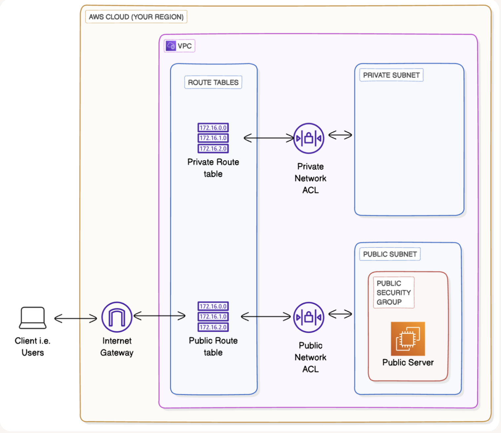

# Creating a Private Subnet

**Project Link:** [View Project](http://learn.nextwork.org/projects/aws-networks-private)

**Author:** Adeem Akhtar  
**Email:** adeemakhtar@gmail.com

---

## Creating a Private Subnet

---

## Introducing Today's Project!

### What is Amazon VPC?

Amazon VPC is a private network that provides isolation within it. It is useful because we can create and arrange the resources required by the architecture. 

### How I used Amazon VPC in this project

In today's project, I used Amazon VPC to create NACLs, Route tables, Public and Private subnets.

### One thing I didn't expect in this project was...

One thing I didn't expect in this project is that, private subnets also require their own NACLs and Route tables to stay private.

### This project took me...

This project took me 55 minutes.

---

## Private vs Public Subnets

The difference between public and private subnets is that public subnet is internet facing through internet gateway and private subnet is isolated and does not connect to the internet for public access directly.

Having private subnets are useful because, there are private resources that are supposed to be residing inside an isolation. Private subnets provides that isolation where they cannot be accessed through internet.

My private and public subnets cannot have the same CIDR block, because the IP address in the VPC could overlap (No two resources can have a single IP address in a single VPC)

---

## A dedicated route table

By default, my private subnet is not associated with any route table.

I had to set up a new route table for my private subnet  because i have to access the resoures residing inside my private subnet later.

My private subnet's dedicated route table only has one inbound and one outbound rule that allows local traffic.

---

## A new network ACL

By default, my private subnet is associated with default network ACL created by AWS.

I set up a dedicated network ACL for my private subnet because i can associate my own access inbound and outbound.

My new network ACL has two simple rules: "deny" all inbound and outbound traffic.

---

---
