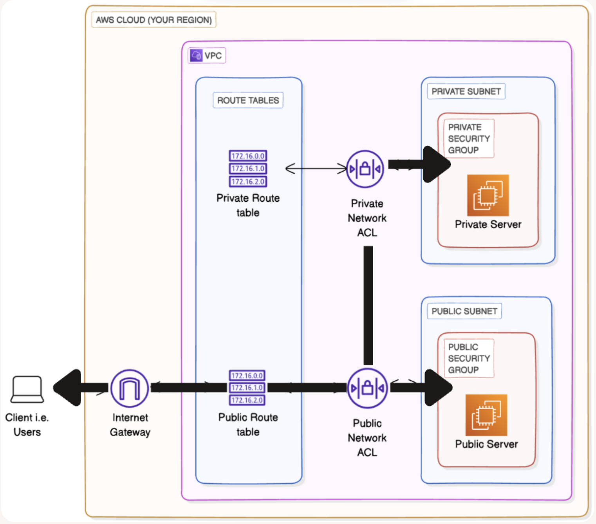

# Testing VPC Connectivity

**Project Link:** [View Project](http://learn.nextwork.org/projects/aws-networks-connectivity)

**Author:** Adeem Akhtar  
**Email:** adeemakhtar@gmail.com

---

## Testing VPC Connectivity

---

## Introducing Today's Project!

### What is Amazon VPC?

Amazon VPC is an isolated private network inside the cloud, and it is useful because we can arrange the resources inside it and assign unique IP addresses.

### How I used Amazon VPC in this project

In today's project, I used Amazon VPC to launch 2 subnets, NACL, Security groups, Route tables and EC2 instances.

### One thing I didn't expect in this project was...

One thing I didn't expect in this project was troubleshooting the issues appeared in CLI.

### This project took me...

This project took me 30 minutes

---

## Connecting to an EC2 Instance

Connectivity means to be connected to the specific resource through specified protocol and port.

My first connectivity test was whether I could connect to NextWork Public Server.

---

## EC2 Instance Connect

I connected to my EC2 instance using EC2 Instance Connect, which is secure shell SSH and we can interect with the EC2 directly using CLI commands.

My first attempt at getting direct access to my public server resulted in an error, because we did not added the inbound rule that allows SSH inbound traffic towards EC2 instance through the Security Group.

I fixed this error by adding a new rule in the inbound rules of the security group. The rule is SSH at port 22 from anywhere IPv4.

---

## Connectivity Between Servers

Ping is a common computer network tool used to check whether your computer can communicate with another computer or device on a network. I used ping to test the connectivity between public and private EC2 instances.

The ping command I ran was "ping 10.0.1.25"

The first ping returned nothing for a long time. This meant both machines were unsuccessful in establishing a connection between themselves.

---

## Troubleshooting Connectivity

I troubleshooted this by adding the Internet Control Message Protocol (ICMP) traffic inbound and outbound rules in the private NACL.
I also added the inbound traffic rule from the public security group to my private security group.

---

## Connectivity to the Internet

Curl is a network command that fatches the data form the website domain.

I used curl to test the connectivity between internet and EC2 instance in public subnet

### Ping vs Curl

Ping and curl are different because, ping verifies the connectivity between two machines and note down how much time it to took to respond back by the requested machine.
curl fatches the data from the responding machine as the output.

---

## Connectivity to the Internet

I ran the curl command curl example.com, which returned the HTML response from the server.

---

---
